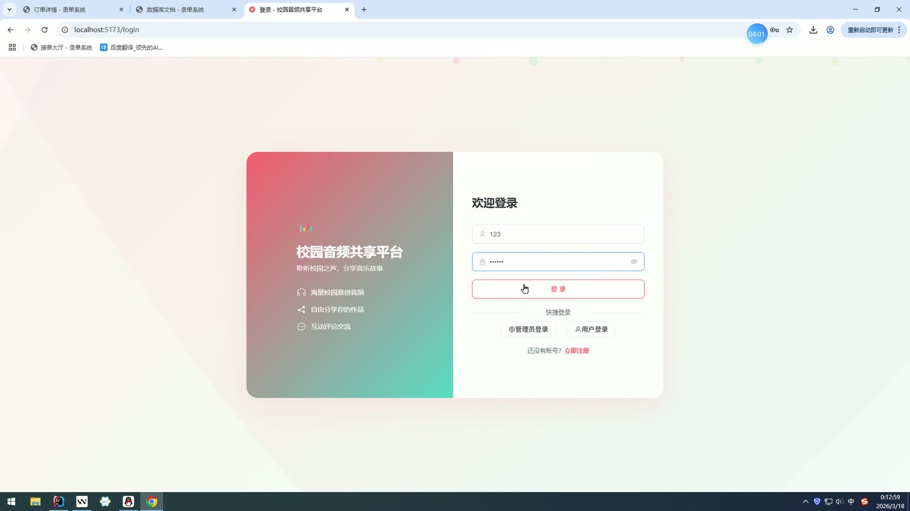
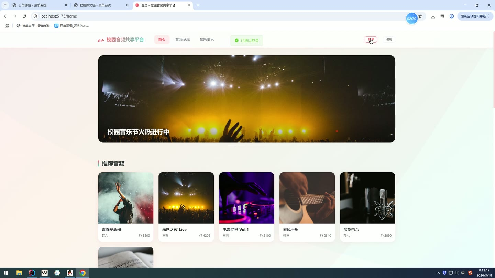
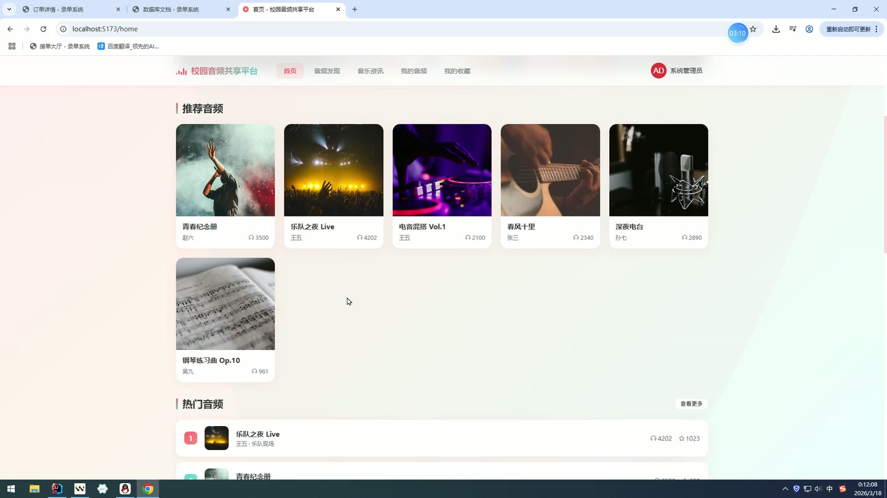
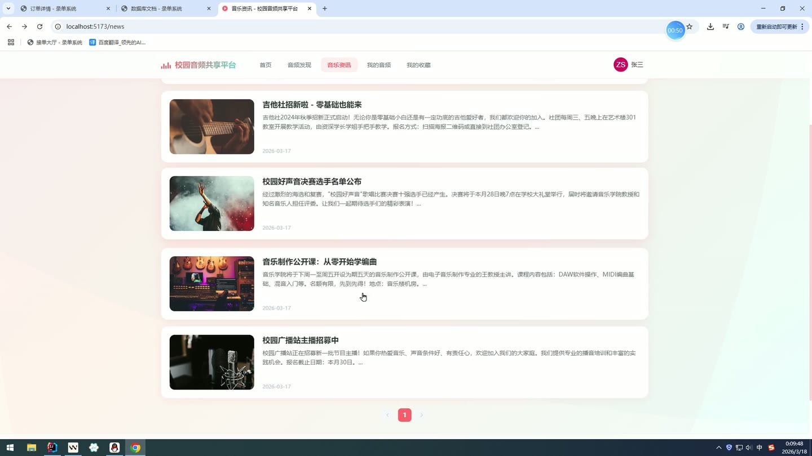
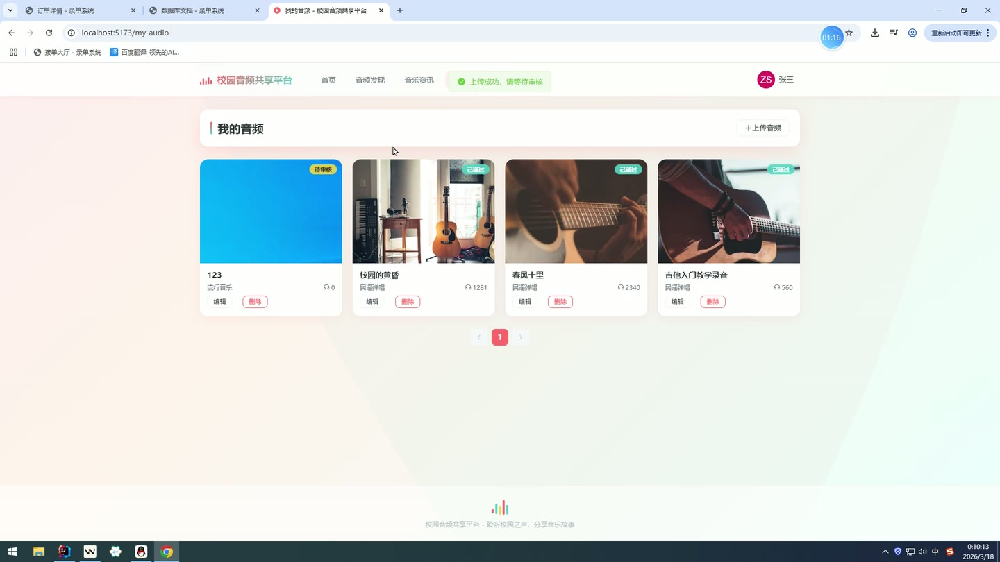
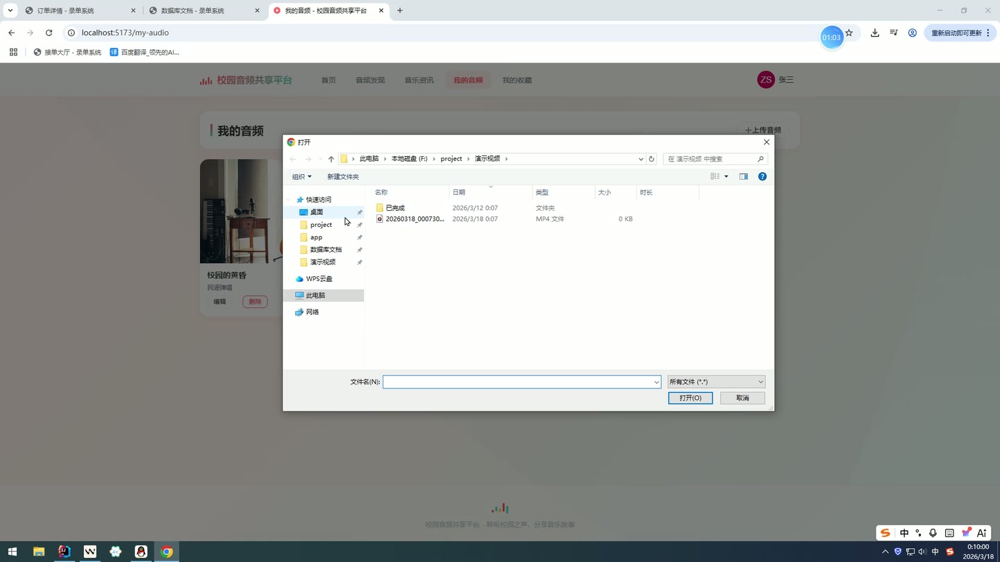

# (附文档)Springboot3+Vue3+MySQL 校园音频共享平台

**技术栈**：Springboot3、Vue3、MySQL

### 系统简介

校园音频共享平台是一套基于 Spring Boot 3 + Vue 3 + MySQL 的前后端分离系统，支持普通用户与管理员双角色。普通用户可以浏览、上传、收藏、评论音频，查看音乐资讯并提交反馈；管理员在后台对音频、用户、评论、分类、轮播图、推荐位、资讯、反馈等进行统一管理。系统内置 JWT 登录校验与文件上传功能，适用于校园场景下的音频分享与管理。
 
### 核心功能
 
### 普通用户端

 
- 注册新账号（填写用户名/密码/昵称/邮箱/手机号，自动分配 USER 角色） 
- 登录系统（用户名+密码登录，返回 JWT Token 与用户信息） 
- 查看个人信息（获取当前登录用户的昵称/头像/邮箱/手机号/简介/角色/状态） 
- 修改个人信息（更新昵称、头像、邮箱、手机号、个人简介） 
- 修改密码（验证原密码后设置新密码） 
- 浏览首页轮播图（展示状态为启用的轮播图，按排序字段排列） 
- 查看音频分类列表（按排序字段排列所有分类） 
- 浏览推荐音频（按排序字段获取推荐位中的已审核音频） 
- 查看热门音频（按播放量降序取前 10 条已审核音频） 
- 查看最新音频（按创建时间降序取前 10 条已审核音频） 
- 搜索音频列表（支持按标题/描述关键词、分类 ID 分页查询已审核音频） 
- 查看音频详情（展示音频标题/描述/封面/音频文件/播放量/点赞数/收藏数/上传者/分类，播放量 +1） 
- 查看音频评论列表（分页查看该音频下的正常评论，显示评论者昵称与头像） 
- 上传音频（填写标题/描述/封面/音频文件/分类，状态默认为待审核） 
- 管理我的音频（查看自己上传的音频列表，支持编辑标题/描述/封面/分类，支持删除） 
- 收藏/取消收藏音频（点击切换收藏状态，收藏数同步更新） 
- 点赞/取消点赞音频（点击切换点赞状态，点赞数同步更新） 
- 查看收藏列表（分页展示已收藏的音频） 
- 发表评论（对指定音频发表评论内容，状态默认为正常） 
- 管理我的评论（查看自己发表的评论列表，显示对应的音频标题，支持删除） 
- 浏览音乐资讯列表（分页查看所有资讯，按创建时间降序） 
- 查看资讯详情（展示资讯标题、内容、封面、作者、创建时间） 
- 提交意见反馈（填写反馈内容，状态为待回复） 
- 查看我的反馈记录（分页查看自己提交的反馈及管理员回复） 
- 上传文件（支持上传图片或音频文件，按扩展名自动归类到 images 或 audio 子目录）
 
### 管理员端

 
- 查看仪表盘总览（展示用户总数、音频总数、评论总数、待审核音频数、已审核音频数、活跃用户数、正常评论数、屏蔽评论数） 
- 管理音频分类（新增/编辑/删除分类，设置分类名称、描述、排序值） 
- 管理音频资源（分页查询音频列表，支持按关键词/分类/状态筛选，审核通过/驳回音频，编辑音频信息，删除音频） 
- 管理用户（分页查询用户列表，支持按用户名/昵称搜索，启用或禁用用户账号，删除用户） 
- 管理评论（分页查看所有评论，支持按状态筛选，屏蔽/取消屏蔽评论，删除评论，列表显示评论者昵称与所属音频标题） 
- 管理资讯（新增/编辑/删除资讯，填写标题/内容/封面，自动记录当前管理员为作者） 
- 管理推荐位（查看推荐列表，新增/编辑/删除推荐记录，设置关联音频与排序值） 
- 管理反馈（分页查看用户反馈，支持按状态筛选，回复反馈并标记为已回复，记录回复时间） 
- 管理轮播图（新增/编辑/删除轮播图，设置标题/图片/链接/排序/启用状态） 
- 修改个人信息（更新管理员自己的昵称/头像/邮箱/手机号/简介） 
- 修改个人密码（验证原密码后设置新密码）
 
### 技术栈

 后端框架Spring Boot 3 ORMMyBatis-Plus 权限校验JWT（jjwt）+ 自定义拦截器 密码加密BCrypt（jBCrypt） 前端框架Vue 3（Composition API + setup 语法） 状态管理Pinia 路由Vue Router 4（history 模式） UI 组件库Element Plus 构建工具Vite 数据库MySQL 文件上传Spring MultipartFile + 本地存储
 
### 交付内容

 
- 后端完整源码 
- 前端完整源码 
- 数据库初始化脚本 
- 万字文档

## 界面展示

---

## 获取完整源码 + 万字文档

本仓库为项目介绍页。**完整前后端源码、数据库初始化脚本、万字项目文档**，请加微信 `kangkangcode`，或访问 [codekk.top](http://codekk.top) 获取。

可作课程设计 / 毕业设计参考，支持远程部署调试。